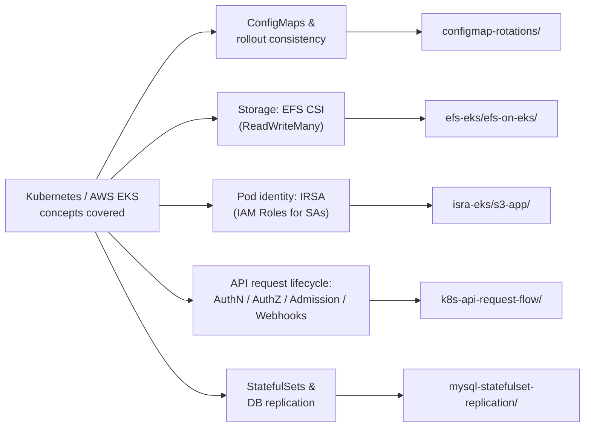

# kubernetes

A collection of focused, hands-on Kubernetes operational demos — each one
isolates a single concept (ConfigMap rollout mechanics, EFS-backed shared
storage, IRSA-based pod identity, the API request lifecycle, StatefulSet
database replication) and works through it end-to-end with real manifests
and runnable scripts, not slideware.

This is **not** a single application. It's five independent sub-projects
that happen to live in one repository because they share a theme. Each has
its own README with prerequisites, step-by-step commands, and — where
relevant — real captured output from an actual run.

## Navigation

| Demo | What it covers | Docs |
|---|---|---|
| [`configmap-rotations/`](configmap-rotations/) | Spring Boot app on a ConfigMap-mounted `application.yaml`; shows exactly when (and when not) a running pod picks up a config change, plus checksum-annotation and Stakater Reloader patterns to close the gap | [README](configmap-rotations/README.md) |
| [`efs-eks/efs-on-eks/`](efs-eks/efs-on-eks/) | Amazon EFS as a `ReadWriteMany` volume on EKS via the EFS CSI driver — StorageClass, PVC, and a Deployment mounting shared storage | [README](efs-eks/README.md) |
| [`isra-eks/s3-app/`](isra-eks/s3-app/) | IAM Roles for Service Accounts (IRSA): a Spring Boot app reads/writes S3 using only a ServiceAccount-scoped IAM role — no static AWS keys anywhere | [README](isra-eks/README.md) |
| [`k8s-api-request-flow/`](k8s-api-request-flow/) | The full `kubectl apply` → API server pipeline (authn → RBAC → admission controllers → Kyverno webhook) as runnable labs, promoted through Kustomize `dev`/`staging`/`prod` overlays with real per-environment enforcement differences | [README](k8s-api-request-flow/README.md) · [TESTING](k8s-api-request-flow/TESTING.md) |
| [`mysql-statefulset-replication/`](mysql-statefulset-replication/) | Two independent MySQL 8.0 StatefulSets wired into source → replica (GTID) replication; includes a PodDisruptionBudget failure-mode demo (`minAvailable` that can never be satisfied) | [README](mysql-statefulset-replication/README.md) |

## Concept map

Which Kubernetes/AWS concept each demo is built around:

## Tech stack

- **Orchestration**: Kubernetes (Minikube/kind for local demos, Amazon EKS for the two AWS-specific demos)
- **Config management**: Kustomize (`base/` + `overlays/` in `k8s-api-request-flow/`)
- **Policy-as-code**: Kyverno (`ClusterPolicy` admission webhooks)
- **Automated rollout**: Stakater Reloader (`configmap-rotations/`)
- **AWS**: EKS, IAM/IRSA (OIDC federation), EFS + the EFS CSI driver, S3, ECR
- **Application runtimes**: Spring Boot (Java 17, Maven and Gradle), MySQL 8.0
- **Containers**: Docker (multi-stage builds)

## Prerequisites (general)

Each subdirectory lists its own specifics, but across the set you'll generally need:

- `kubectl`, pointed at a cluster you control (local Minikube/kind for
  `configmap-rotations/`, `k8s-api-request-flow/`, and
  `mysql-statefulset-replication/`; a real EKS cluster for `efs-eks/` and
  `isra-eks/`, since IRSA and the EFS CSI driver depend on EKS-specific
  OIDC/CSI plumbing that a local cluster doesn't provide)
- `docker`, for building the image-based demos
- `bash` (Git Bash or WSL on Windows) — every script is POSIX shell
- For the AWS demos: an AWS account/CLI configured with permissions to
  create IAM policies/roles and (for `efs-eks/`) an existing EFS file
  system and the [aws-efs-csi-driver](https://github.com/kubernetes-sigs/aws-efs-csi-driver) add-on installed on the cluster

## CI

[`.github/workflows/validate.yml`](.github/workflows/validate.yml) runs
static, credential-free validation on every push/PR to `main` — no real AWS
account or Kubernetes cluster is touched. It's split into one job per
concern, covering all five sub-projects:

| Job | What it checks | Scope |
|---|---|---|
| `yamllint` | YAML syntax/indentation sanity | Raw manifests in `configmap-rotations/k8s`, `efs-eks/efs-on-eks`, `isra-eks/s3-app`, `mysql-statefulset-replication/manifests` |
| `kubeconform` | Manifests validate against upstream Kubernetes OpenAPI schemas | Same raw-manifest set as `yamllint` |
| `kustomize-build` | The Kustomize base/overlay tree actually renders | `k8s-api-request-flow/overlays/{dev,staging,prod}` via `kubectl kustomize` |
| `java-build` | The Spring Boot app compiles | `configmap-rotations/` via `mvn -B compile` |

`k8s-api-request-flow/` is intentionally validated only by
`kustomize-build`, not `yamllint`/`kubeconform` — it's Kustomize
bases/overlays/patches, not directly-appliable manifests, so a build check
is the meaningful signal there. `efs-eks/efs-on-eks/test.yaml` is excluded
from `yamllint`/`kubeconform` (see workflow comments): it's the
intentionally-incomplete reference Deployment called out under "Known
issues" below, with blank placeholder fields that fail strict schema
typing. There's no compile job for `isra-eks/s3-app/` — its `build.gradle`
pins a Spring Boot **SNAPSHOT** version from `repo.spring.io/snapshot`,
which is non-reproducible in CI (snapshot artifacts get purged), so a
build step there would be flaky independent of the code itself.

## Security considerations across this repo

- **`mysql-statefulset-replication/manifests/01-mysql-a-secret.yaml` and
  `04-mysql-b-secret.yaml` contain plaintext example passwords**
  (`rootpass-a`, `rootpass-b`) in `stringData`. This is called out
  explicitly in that demo's own README as "local learning only" — it is
  intentional for a runnable demo, but **do not reuse these manifests
  as-is** outside a throwaway local cluster. In a real environment, use a
  Secrets manager (AWS Secrets Manager, Sealed Secrets, External Secrets
  Operator, SOPS, etc.) instead of committing credentials to Git, even
  placeholder ones.
- **`isra-eks/s3-app/`'s `application.properties` ships with empty
  `aws.access.key` / `aws.secret.key` fields.** They are unused dead
  configuration — the app's `S3Config` builds `S3Client` with only a
  region set, so it resolves credentials through the AWS SDK's default
  credential provider chain, which is what actually picks up the
  IRSA-issued web identity token in-cluster. No static keys are read or
  required; the empty properties are misleading vestiges worth removing if
  this app is developed further, but they hold no secret material as
  committed.
- **AWS account IDs, OIDC provider IDs, and IAM Role IDs in
  `isra-eks/s3-app/IRSA-implementation/`** (`12345`, example OIDC hashes,
  an `AROA...` Role ID) are illustrative placeholders, not real
  credentials — they follow AWS's ID formats but are not valid/live
  identifiers.
- **`efs-eks/efs-on-eks/storageclass.yaml` uses a placeholder
  `fileSystemId: fs-12345454532t`** — replace with your real EFS
  filesystem ID before applying; it will not resolve as-is.
- No demo in this repo stores long-lived AWS access keys in a Kubernetes
  `Secret` — the two AWS-integrated demos (`efs-eks/`, `isra-eks/`) both
  rely on IRSA/IAM roles for authorization instead, which is the
  recommended pattern.

## Known issues / recommendations

- **Inconsistent structure across demos.** `k8s-api-request-flow/` has
  been modernized into a Kustomize `base/`+`overlays/` layout with its own
  `TESTING.md`; `configmap-rotations/` and `mysql-statefulset-replication/`
  are flat-manifest demos with strong READMEs; `efs-eks/` and `isra-eks/`
  are minimal manifest/policy examples with no automation scripts at all.
  This is reasonable given each demo's scope, but a newcomer should not
  expect the same level of polish or the same command patterns (`kubectl
  apply -k` vs. plain `kubectl apply -f`) everywhere.
- **`eks-isra` → `isra-eks` rename.** Git history shows an early commit
  `31c5c91 efs and isra implementation for eks`, a later `8378054 Updated
  eks isra`, then `764adf5 deletion of eks-isra` — immediately followed by
  the current `isra-eks/` directory being present in the tree. This reads
  as a rename/restructure (old `eks-isra` path replaced by `isra-eks/`)
  rather than a loss of content; the IRSA S3 demo itself is intact and
  functional in its current location.
- **CI added, but narrow.** `.github/workflows/validate.yml` (see the
  [CI](#ci) section above) now covers YAML lint, `kubeconform` schema
  validation, a Kustomize build check, and a Maven compile — but there's
  still no `shellcheck` on the various `.sh` scripts, and no compile check
  for `isra-eks/s3-app/` (blocked by its SNAPSHOT dependency, see CI
  section). Adding `shellcheck` and pinning `isra-eks/s3-app/` to a
  released Spring Boot version so it can be compiled in CI too are the
  natural next steps here.
- **`efs-eks/` and `isra-eks/` have no automation scripts**, unlike the
  other three demos — they're manifest/policy references you apply by hand
  with `kubectl`/`aws` CLI commands from their README, not scripted
  end-to-end walkthroughs. Worth flagging as a gap if the goal is
  consistency with the rest of the repo.
- **`efs-eks/efs-on-eks/test.yaml`** is a fairly specific, real-looking
  Deployment (Elastic APM sidecar, `hostAliases`, ECR-style image
  references left blank) rather than a minimal EFS-mount example — it
  works as a demonstration of `persistentVolumeClaim: efs-claim` in a
  `volumeMounts`, but a newcomer skimming it for "how do I mount EFS"
  has to filter out unrelated APM/timezone plumbing to find the relevant
  four lines.
- **No root LICENSE previously.** Added `LICENSE` (MIT) at the repo root
  in this pass — was previously missing.
- **Root README was a one-line stub** before this pass ("Kubernetes POC
  and implementations") with no index, architecture, or per-demo
  navigation — addressed by this document.

## Status & roadmap

| Demo | Status |
|---|---|
| `configmap-rotations/` | Complete, documented, scripted end-to-end |
| `k8s-api-request-flow/` | Complete, documented, scripted end-to-end, recently restructured to Kustomize |
| `mysql-statefulset-replication/` | Complete, documented, scripted end-to-end |
| `efs-eks/efs-on-eks/` | Reference manifests only — functional but manual (no scripts); README added in this pass |
| `isra-eks/s3-app/` | Reference implementation + working Spring Boot app — manual setup (no scripts); README added in this pass |

Possible next steps: add `shellcheck`/manifest-lint CI, script the two AWS
demos the same way the three cluster-local demos are scripted, and align
the AWS demos' documentation structure (a `TESTING.md`-style captured-output
doc) with `k8s-api-request-flow/`.

## License

[MIT](LICENSE)
