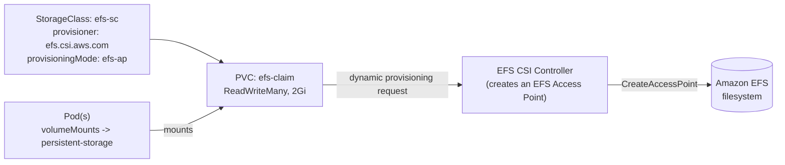

# efs-eks — Amazon EFS as ReadWriteMany storage on EKS

Demonstrates mounting an [Amazon EFS](https://aws.amazon.com/efs/) file
system into pods on EKS as a `ReadWriteMany` (RWX) volume via the
[EFS CSI driver](https://github.com/kubernetes-sigs/aws-efs-csi-driver), so
multiple pods/nodes can share the same storage concurrently — something the
default EBS-backed `gp2`/`gp3` StorageClasses cannot do (EBS volumes are
`ReadWriteOnce`, attachable to only one node at a time).

All files live under [`efs-on-eks/`](efs-on-eks/).

## Why EFS instead of EBS here

EBS volumes follow the pod's node — fine for a single-writer workload (like
the MySQL StatefulSets elsewhere in this repo), but they can't be mounted by
pods on two different nodes simultaneously. EFS is an NFS-backed, regional
filesystem: any number of pods, on any number of nodes, can mount the same
filesystem read-write at once. That's the specific gap this demo fills.

## Layout

```
efs-on-eks/
  iam-policy-example.json   IAM policy for the EFS CSI driver's IAM role (IRSA)
  storageclass.yaml         StorageClass: provisioner efs.csi.aws.com, dynamic access-point provisioning
  pvc.yaml                  PVC requesting 2Gi RWX against that StorageClass
  test.yaml                 Example Deployment mounting the resulting PVC at /test/logs
```

## How it fits together



1. **`storageclass.yaml`** defines `efs-sc`, using `provisioningMode:
   efs-ap` — the CSI driver provisions a new **EFS Access Point** per PVC
   (rather than you pre-creating one), scoped under `basePath: /app-data`
   with POSIX directory permissions `700` and an optional GID range
   (`1000`–`2000`) for multi-tenant UID/GID isolation.
2. **`pvc.yaml`** requests a `ReadWriteMany` volume named `efs-claim`
   against `efs-sc`. The `2Gi` request is nominal — EFS is elastic storage,
   billed by actual usage, not a hard-provisioned size like EBS.
3. **`test.yaml`** is an example Deployment (`test-app`) that mounts
   `efs-claim` at `/test/logs` via a `persistent-storage` volume. It also
   carries unrelated Elastic APM sidecar/timezone configuration copied from
   a real-world deployment template — when adapting this file, the only
   parts relevant to the EFS demo are the `volumes:` entry referencing
   `efs-claim` and the corresponding `volumeMounts` entry; everything else
   (the `elastic-apm-agent` init container, `ELASTIC_APM_*` env vars,
   `tz-asia` hostPath mount) can be deleted for a minimal repro.

## IAM policy explained (`iam-policy-example.json`)

This is the IAM policy attached to the **EFS CSI driver's** IAM role (via
IRSA — see [`isra-eks/README.md`](../isra-eks/README.md) in this repo for
how IRSA itself works), not to the application pod. It grants the CSI
controller only what it needs to dynamically provision/deprovision access
points:

| Statement | Permissions | Purpose |
|---|---|---|
| 1 | `DescribeAccessPoints`, `DescribeFileSystems`, `DescribeMountTargets`, `ec2:DescribeAvailabilityZones` | Read-only discovery the driver needs to validate the filesystem and mount targets exist and are reachable |
| 2 | `CreateAccessPoint`, scoped to requests tagged `efs.csi.aws.com/cluster: true` | Lets the driver create a new access point per PVC, but only ones it tags as belonging to this cluster |
| 3 | `TagResource`, scoped to resources tagged `efs.csi.aws.com/cluster: true` | Lets the driver tag the access points it creates |
| 4 | `DeleteAccessPoint`, scoped to resources tagged `efs.csi.aws.com/cluster: true` | Lets the driver clean up access points when a PVC is deleted (only ones it created/tagged) |

All four statements use `Resource: "*"` but are constrained by the
`aws:RequestTag`/`aws:ResourceTag` conditions on the cluster-ownership tag —
this is the standard AWS-published least-privilege policy for the EFS CSI
driver, not broadened here. It is **not** a policy for application access to
files — the pod itself doesn't call AWS APIs to read/write; it just uses a
regular POSIX filesystem mount, and the CSI driver/kubelet handle the NFS
plumbing underneath.

## Usage

Prerequisites:

- An existing EKS cluster with OIDC/IRSA enabled
  (`aws eks associate-identity-provider-config` / `eksctl utils
  associate-iam-oidc-provider` — most `eksctl`-created clusters already
  have this).
- An existing Amazon EFS filesystem in the same VPC as the cluster, with
  mount targets in each subnet/AZ the nodes run in, and a security group
  that allows NFS (port 2049) from the node security group.
- The [aws-efs-csi-driver](https://github.com/kubernetes-sigs/aws-efs-csi-driver)
  add-on installed on the cluster, with its controller ServiceAccount bound
  (via IRSA) to an IAM role carrying a policy at least as permissive as
  `iam-policy-example.json`:

  ```bash
  aws iam create-policy --policy-name EFSCSIControllerPolicy \
    --policy-document file://efs-on-eks/iam-policy-example.json

  eksctl create iamserviceaccount \
    --cluster <cluster-name> \
    --namespace kube-system \
    --name efs-csi-controller-sa \
    --attach-policy-arn arn:aws:iam::<account-id>:policy/EFSCSIControllerPolicy \
    --approve

  eksctl create addon --cluster <cluster-name> --name aws-efs-csi-driver \
    --service-account-role-arn arn:aws:iam::<account-id>:role/<the-role-eksctl-created>
  ```

Deploy:

```bash
# Replace the placeholder fileSystemId (fs-12345454532t) with your real
# EFS filesystem ID first.
kubectl apply -f efs-on-eks/storageclass.yaml
kubectl apply -f efs-on-eks/pvc.yaml

kubectl get pvc efs-claim -w
# STATUS should go Pending -> Bound once the CSI controller provisions
# the access point.

kubectl apply -f efs-on-eks/test.yaml
kubectl get pods -l app=test-app
```

Confirm the mount:

```bash
kubectl exec -it deploy/test-app -- sh -c "mount | grep /test/logs; echo hello > /test/logs/hello.txt"
```

## Cleanup

```bash
kubectl delete -f efs-on-eks/test.yaml
kubectl delete -f efs-on-eks/pvc.yaml
kubectl delete -f efs-on-eks/storageclass.yaml
```

Deleting the PVC triggers the CSI driver to delete the EFS **access point**
it created — it does **not** delete the underlying EFS filesystem itself
(that's a separate AWS resource, managed outside Kubernetes).

## Security notes

- `storageclass.yaml` ships with a placeholder `fileSystemId:
  fs-12345454532t` — this will fail to resolve until replaced with a real
  filesystem ID.
- `iam-policy-example.json` is scoped to actions tagged with this cluster's
  ownership tag, not broad EFS access — review it before attaching to a
  shared/production IAM role.
- No credentials of any kind are stored in these manifests; the CSI
  driver's AWS permissions come from IRSA (its own ServiceAccount's IAM
  role), the same pattern used in `isra-eks/`.
