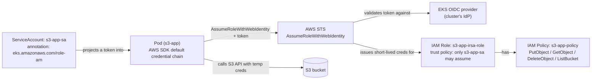

# isra-eks — IAM Roles for Service Accounts (IRSA) for S3 access

A working Spring Boot app on EKS that reads/writes an S3 bucket using
**IAM Roles for Service Accounts (IRSA)** instead of static AWS access
keys. The pod's identity is a Kubernetes ServiceAccount annotated with an
IAM role ARN; the AWS SDK inside the pod exchanges a projected OIDC token
for short-lived AWS credentials automatically — no `aws.access.key`/
`aws.secret.key` value is ever read or required at runtime.

> Note on the directory name: git history shows an earlier `eks-isra`
> directory being removed (`764adf5 deletion of eks-isra`) around the same
> point this `isra-eks/` directory appears in the tree — consistent with a
> rename/restructure rather than a loss of content. The demo itself
> (S3 app + IRSA wiring) is intact here.

All files live under [`s3-app/`](s3-app/).

## What's actually in here

```
s3-app/
  s3/                         Spring Boot app (Gradle) - the real source of truth
    src/main/java/com/example/demo/
      S3Application.java
      config/S3Config.java     Builds S3Client with only a region set (no static creds)
      controller/S3Controller.java   POST /s3/create, DELETE /s3/delete
      service/S3Service.java   putObject/deleteObject against a configured bucket
  Dockerfile/
    Dockerfile                 amazoncorretto:17, copies a pre-built jar + application.properties
    application.properties     aws.s3.bucket, aws.access.key, aws.secret.key, server.port (all blank as committed)
  IRSA-implementation/
    Readme.md                  Full walkthrough: policy -> OIDC -> role -> trust policy -> ServiceAccount
    serviceaccount.yaml        ServiceAccount + Deployment + Service wiring for the s3-app namespace
    "IAM policy for s3"        Example least-privilege S3 policy (PutObject/GetObject/DeleteObject/ListBucket)
    implementation              Session transcript of the actual AWS CLI commands run to set this up
```

## How IRSA works here



1. **`IRSA-implementation/IAM policy for s3`** — a least-privilege S3
   policy: `PutObject`/`GetObject`/`DeleteObject` on `<bucket>/*`, and
   `ListBucket` on the bucket itself. (This file, and the `implementation`
   transcript, use example bucket names like `testdata`/`data` — swap for
   your real bucket.)
2. **Trust policy** (`IRSA-implementation/Readme.md`, step 3) restricts
   `sts:AssumeRoleWithWebIdentity` on the IAM role to exactly one
   ServiceAccount identity via the OIDC provider's `:sub` condition —
   `system:serviceaccount:s3-app:s3-app-sa`. No other ServiceAccount, in
   any namespace, can assume this role.
3. **`IRSA-implementation/serviceaccount.yaml`** creates:
   - `ServiceAccount s3-app-sa` in namespace `s3-app`, annotated
     `eks.amazonaws.com/role-arn: arn:aws:iam::<account>:role/s3-app-irsa-role`
     — this annotation is what triggers the EKS Pod Identity webhook to
     inject the projected token volume and `AWS_ROLE_ARN`/
     `AWS_WEB_IDENTITY_TOKEN_FILE` env vars into pods using this SA.
   - `Deployment s3-app`, 1 replica, `serviceAccountName: s3-app-sa`,
     image `<account>.dkr.ecr.ap-south-1.amazonaws.com/s3-test-app:latest`.
   - `Service s3-app`, `NodePort`, port 8080.
4. **The application** (`s3/src/main/java/.../config/S3Config.java`) builds
   `S3Client.builder().region(Region.AP_SOUTH_1).build()` — **no
   credentials provider is set explicitly**. The AWS SDK v2's default
   credential provider chain finds the IRSA-injected environment variables
   automatically and resolves temporary, auto-rotating credentials from
   them. This is the entire point of IRSA: the application code needs zero
   AWS-credential-handling logic.

## `application.properties` — the unused key fields

`Dockerfile/application.properties` (and the equivalent in `s3/src/main/
resources/`) declares `aws.access.key` and `aws.secret.key` properties, but
**nothing in the codebase reads them** — `S3Service` only injects
`aws.s3.bucket` via `@Value`, and `S3Config` never references AWS key
properties at all. As committed, both are blank, so this holds no secret
material — but they're dead/misleading configuration and safe to delete if
this app is developed further, precisely so nobody is tempted to fill them
in and reintroduce static credentials.

## Usage

Prerequisites:

- An EKS cluster with an IAM OIDC provider associated (see
  `efs-eks/README.md` in this repo for the same prerequisite, or run
  `eksctl utils associate-iam-oidc-provider --cluster <name> --approve`).
- An S3 bucket you're allowed to grant access to.
- AWS CLI configured with permission to create IAM policies/roles.
- (To build the app yourself) JDK 17 and the Gradle wrapper included at
  `s3-app/s3/gradlew`.

Follow [`s3-app/IRSA-implementation/Readme.md`](s3-app/IRSA-implementation/Readme.md)
end-to-end — it is a complete, self-contained walkthrough:

1. Create the S3 IAM policy (`aws iam create-policy`).
2. Look up the cluster's OIDC issuer and confirm the IAM OIDC provider
   exists (`aws eks describe-cluster`, `aws iam
   list-open-id-connect-providers`).
3. Create the IAM role with a trust policy scoped to the `s3-app-sa`
   ServiceAccount (`aws iam create-role`).
4. Attach the S3 policy to the role (`aws iam attach-role-policy`).
5. Apply the ServiceAccount/Deployment/Service:
   ```bash
   kubectl create namespace s3-app
   kubectl apply -f s3-app/IRSA-implementation/serviceaccount.yaml
   ```
6. Exercise the app:
   ```bash
   kubectl port-forward -n s3-app svc/s3-app 8080:8080
   curl -X POST http://localhost:8080/s3/create   # writes irsa-test.txt to the bucket
   curl -X DELETE http://localhost:8080/s3/delete # deletes it
   ```
7. Verify the pod is actually using the assumed role, not any ambient
   credentials:
   ```bash
   kubectl exec -it -n s3-app deploy/s3-app -- aws sts get-caller-identity
   # Arn should show .../assumed-role/s3-app-irsa-role/...
   ```

Building the jar referenced by `Dockerfile/Dockerfile` yourself:

```bash
cd s3-app/s3
./gradlew bootJar
cp build/libs/s3-0.0.1-SNAPSHOT.jar ../Dockerfile/
cd ../Dockerfile
docker build -t s3-test-app:latest .
```

## Cleanup

```bash
kubectl delete -f s3-app/IRSA-implementation/serviceaccount.yaml
kubectl delete namespace s3-app

aws iam detach-role-policy --role-name s3-app-irsa-role --policy-arn arn:aws:iam::<account-id>:policy/s3-app-policy
aws iam delete-role --role-name s3-app-irsa-role
aws iam delete-policy --policy-arn arn:aws:iam::<account-id>:policy/s3-app-policy
```

## Security notes

- No static AWS access keys are used or stored anywhere in this demo —
  credentials are short-lived and issued via `AssumeRoleWithWebIdentity`,
  scoped to exactly one namespace/ServiceAccount pair by the role's trust
  policy.
- Account IDs (`12345`), OIDC provider hashes, and the example IAM Role ID
  (`AROARZCM3QNMMJVGNH7AZ`) throughout `IRSA-implementation/Readme.md` and
  `implementation` are illustrative placeholders in AWS's real ID formats,
  not live/valid identifiers — nothing sensitive is exposed by them, but
  don't assume they're reusable.
- The IAM policy in `IRSA-implementation/IAM policy for s3` scopes
  `PutObject`/`GetObject`/`DeleteObject` to a single bucket's objects and
  `ListBucket` to that bucket only — review and tighten the bucket name
  (currently example values like `testdata`/`data`) before reuse.
- `application.properties`' blank `aws.access.key`/`aws.secret.key` fields
  are unused by the code as noted above; if you do wire them up in a fork,
  reintroducing static keys defeats the purpose of this demo.
