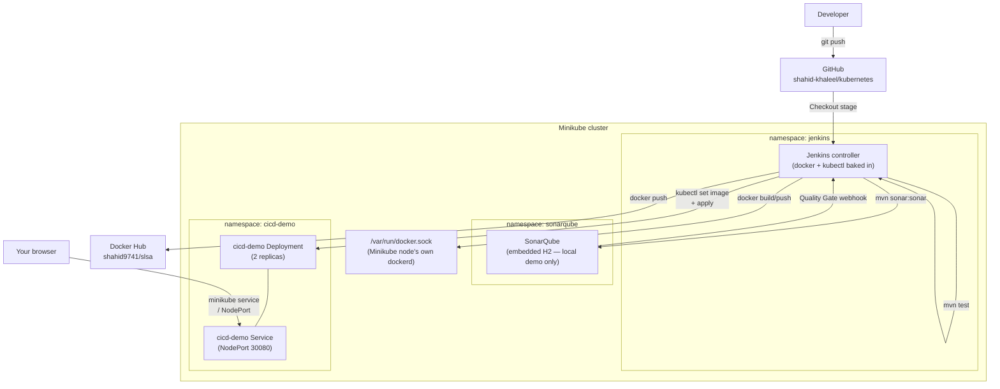

# Jenkins + SonarQube + Docker + Minikube CI/CD Demo


A complete, working sample CI/CD project: a small Spring Boot web app, built and
quality-checked by a Jenkins declarative pipeline running SonarQube analysis,
packaged into a Docker image pushed to Docker Hub, and deployed onto a local
Minikube cluster — with Jenkins and SonarQube themselves *also* running on
that same Minikube cluster.

## What's actually been verified vs. what you run yourself

Everything below **except the full Jenkins UI setup and a live pipeline
run** was built and verified for real while putting this together — not
just written and hoped-correct:

| Piece | How it was verified |
|---|---|
| Spring Boot app (`app/`) | Built with `mvn clean verify` in a containerized Maven — **11/11 tests pass** (`GreetingServiceTest`, `VisitCounterServiceTest`, `HomeControllerTest`, `CicdDemoApplicationTests`) |
| `app/Dockerfile` | `docker build` succeeds; the running container answers `/`, `/greet`, `/actuator/health`, `/actuator/health/liveness`, `/actuator/health/readiness` all with `200` |
| `k8s/deployment.yaml` + `k8s/service.yaml` | Applied to a real Minikube cluster, rolled out to `2/2 Ready`, and reached over the Service — see [Known issue #1](#known-issues--production-considerations) below for a real bug this caught |
| `jenkins/Dockerfile` + `jenkins/plugins.txt` | Built for real — see [Known issue #2](#known-issues--production-considerations) for a real bug this caught — and confirmed `docker` + `kubectl` both work inside the resulting image |
| `jenkins/*.yaml`, `sonarqube/*.yaml` | Schema-validated against a live Kubernetes API server (`kubectl apply --dry-run=server`) |
| A full Jenkins pipeline run (build → SonarQube → Docker push → deploy) | **Not run.** It needs your own Docker Hub credentials and a GitHub-reachable Jenkins, plus interactive browser setup (unlock wizard, credentials, SonarQube token, webhook) that can't be scripted from here. The steps below are exact, but you're the one running them. |
| Screenshots | **None included.** This was built in a terminal-only environment with no browser/GUI available to capture one honestly. Section markers below show exactly where to drop your own as you go through the steps. |

## Architecture



## Repository layout

```
jenkins-sonarqube-cicd/
├── app/                    # Spring Boot application (Maven project)
│   ├── src/main/java/...   # Controller, services, main class
│   ├── src/main/resources/ # Thymeleaf template, CSS, application.properties
│   ├── src/test/java/...   # JUnit 5 unit + MockMvc slice tests
│   ├── pom.xml
│   └── Dockerfile          # Multi-stage: maven:3.9-eclipse-temurin-17 -> eclipse-temurin:17-jre-alpine
├── k8s/                    # Manifests for the *application*
│   ├── namespace.yaml
│   ├── deployment.yaml
│   └── service.yaml
├── jenkins/                # Everything to run Jenkins itself on Minikube
│   ├── Dockerfile          # jenkins/jenkins:lts-jdk17 + docker CLI + kubectl
│   ├── plugins.txt
│   ├── namespace.yaml
│   ├── rbac.yaml           # ServiceAccount + ClusterRole + RoleBinding into cicd-demo
│   ├── pvc.yaml
│   ├── deployment.yaml
│   └── service.yaml
├── sonarqube/               # Everything to run SonarQube itself on Minikube
│   ├── namespace.yaml
│   ├── pvc.yaml
│   ├── deployment.yaml
│   └── service.yaml
├── Jenkinsfile              # The declarative pipeline
└── screenshots/              # Empty on purpose — see "Screenshots" below
```

## Prerequisites

- Docker Desktop (or another Minikube-compatible container runtime)
- [Minikube](https://minikube.sigs.k8s.io/) and `kubectl`
- A Docker Hub account with push access to a repository (this project targets `shahid9741/slsa` — change `DOCKERHUB_REPO` in the `Jenkinsfile` and the image in `k8s/deployment.yaml` if you're using your own)
- A GitHub account (the pipeline checks out `https://github.com/shahid-khaleel/kubernetes.git`)
- ~6 CPUs / ~8GB RAM free for Minikube + Jenkins + SonarQube running together; Java/Maven are **not** required locally — every build step runs inside a Maven or Jenkins container

## Step 1 — Run the app locally (optional, but quick to sanity-check)

No local Maven install needed — this uses a Maven Docker image:

```bash
cd jenkins-sonarqube-cicd/app
docker run --rm -v "$(pwd):/app" -w /app maven:3.9-eclipse-temurin-17 mvn -B clean verify
docker build -t cicd-demo:local .
docker run --rm -p 8080:8080 cicd-demo:local
# then open http://localhost:8080 — you should see the greeting card and be
# able to submit the "Greet me" form
```

## Step 2 — Start Minikube

```bash
minikube start --driver=docker --cpus=4 --memory=4096
kubectl get nodes   # should show "minikube  Ready"
```

## Step 3 — Deploy Jenkins to Minikube

Build the custom Jenkins image (adds the Docker CLI and `kubectl` to the
stock `jenkins/jenkins:lts-jdk17` image, plus the plugins in `plugins.txt`)
and load it straight into Minikube's own image store — no registry push
needed for this one, since it never leaves your machine:

```bash
cd jenkins-sonarqube-cicd/jenkins
docker build -t shahid9741/jenkins-cicd-demo:latest .
minikube image load shahid9741/jenkins-cicd-demo:latest

kubectl apply -f namespace.yaml
kubectl apply -f rbac.yaml
kubectl apply -f pvc.yaml
kubectl apply -f deployment.yaml
kubectl apply -f service.yaml

kubectl -n jenkins rollout status deployment/jenkins --timeout=180s
```

**Docker socket permissions**: `jenkins/deployment.yaml` mounts the
Minikube node's own `/var/run/docker.sock` (this is *not* your host's
Docker Desktop socket — Minikube with the `docker` driver runs its own
`dockerd` inside the node, and a pod's `hostPath` refers to that node's
filesystem) and runs the pod as `root` so it can use that socket regardless
of its group ownership. This is a deliberate local-demo shortcut, not a
production pattern — see [Known issues](#known-issues--production-considerations).

**Helm alternative**, if you'd rather not build a custom image at all (you
lose the baked-in Docker CLI/kubectl/plugins, so you'd configure those
through the Jenkins UI's plugin manager and a `docker`/`kubectl` sidecar
instead):

```bash
helm repo add jenkinsci https://charts.jenkins.io
helm repo update
helm install jenkins jenkinsci/jenkins --namespace jenkins --create-namespace \
  --set controller.serviceType=NodePort --set controller.nodePort=30000
```

### Access Jenkins and finish setup

```bash
kubectl -n jenkins get pods -w   # wait for 1/1 Running
minikube service jenkins -n jenkins --url
```

<!-- SCREENSHOT: Jenkins "Unlock Jenkins" page after opening the URL above -->

Get the initial admin password and unlock:

```bash
kubectl -n jenkins exec deploy/jenkins -- cat /var/jenkins_home/secrets/initialAdminPassword
```

<!-- SCREENSHOT: "Customize Jenkins" screen — choose "Install suggested plugins"
     if you used the Helm install; if you used jenkins/Dockerfile the
     plugins.txt set is already installed, so you can skip straight to
     creating the admin user -->

Create your admin user when prompted, then finish the wizard.

## Step 4 — Configure Jenkins

All under **Manage Jenkins**:

1. **Tools → Maven installations** — add one named exactly `Maven3` (matches
   `tools { maven 'Maven3' }` in the `Jenkinsfile`), "Install automatically",
   any recent 3.9.x version.
2. **Credentials → System → Global credentials → Add Credentials** —
   Kind "Username with password", ID exactly `dockerhub-creds`, your Docker
   Hub username and a
   [Docker Hub access token](https://app.docker.com/settings/personal-access-tokens)
   (not your account password).
3. If your GitHub repo were private you'd also add a GitHub PAT credential
   here and reference it in the `Jenkinsfile`'s `git` step — `shahid-khaleel/kubernetes`
   is public, so the plain checkout URL is enough as committed.

<!-- SCREENSHOT: Manage Jenkins -> Credentials, showing the dockerhub-creds entry (id and username only — never screenshot the token itself) -->

## Step 5 — Deploy SonarQube to Minikube and connect it to Jenkins

```bash
cd jenkins-sonarqube-cicd/sonarqube
kubectl apply -f namespace.yaml
kubectl apply -f pvc.yaml
kubectl apply -f deployment.yaml
kubectl apply -f service.yaml

kubectl -n sonarqube rollout status deployment/sonarqube --timeout=300s
minikube service sonarqube -n sonarqube --url
```

If the pod never becomes Ready, it's almost always the Elasticsearch
`vm.max_map_count` check — `sonarqube/deployment.yaml`'s init container
handles this automatically on most setups, but if your cluster's
PodSecurity policy blocks privileged init containers, set it by hand
first:

```bash
minikube ssh -- sudo sysctl -w vm.max_map_count=262144
```

**Helm alternative:**

```bash
helm repo add sonarqube https://SonarSource.github.io/helm-chart-sonarqube
helm repo update
helm install sonarqube sonarqube/sonarqube --namespace sonarqube --create-namespace \
  --set service.type=NodePort --set service.nodePort=30900
```

<!-- SCREENSHOT: SonarQube first-login screen (default admin/admin, which it will force you to change) -->

Log in (default `admin`/`admin`, you'll be forced to change it), then:

1. **My Account → Security → Generate Token** — name it `jenkins`, copy the
   token immediately (shown once).
2. **Administration → Configuration → Webhooks → Create** —
   name `jenkins`, URL `http://<jenkins-service>:8080/sonarqube-webhook/`
   (use the Jenkins Service's in-cluster DNS name,
   `http://jenkins.jenkins.svc.cluster.local:8080/sonarqube-webhook/`, since
   both are on the same cluster). This is what lets the pipeline's
   `waitForQualityGate` stage get a real answer instead of just timing out.

<!-- SCREENSHOT: SonarQube token generation dialog (blur/crop the token value itself before sharing) -->

Back in Jenkins, **Manage Jenkins → System → SonarQube servers**:
add one named exactly `sonarqube` (matches `SONARQUBE_ENV` in the
`Jenkinsfile`), server URL `http://sonarqube.sonarqube.svc.cluster.local:9000`,
and a Secret Text credential holding the token you generated.

<!-- SCREENSHOT: Manage Jenkins -> System -> SonarQube servers, showing the "sonarqube" server entry with URL filled in (crop the credential dropdown) -->

## Step 6 — Create and run the pipeline

**New Item → Pipeline**, name it `cicd-demo`. Under **Pipeline**, choose
"Pipeline script from SCM", SCM `Git`,
repository URL `https://github.com/shahid-khaleel/kubernetes.git`, branch
`*/main`, script path `jenkins-sonarqube-cicd/Jenkinsfile`.

<!-- SCREENSHOT: Pipeline job configuration screen showing the "Pipeline script from SCM" section filled in as above -->

Click **Build Now**. The pipeline runs the stages defined in
[`Jenkinsfile`](Jenkinsfile):

1. **Checkout** — clones `shahid-khaleel/kubernetes`
2. **Build** — `mvn clean compile` in `app/`
3. **Unit Tests** — `mvn test`, results published via `junit`
4. **SonarQube Analysis** — `mvn sonar:sonar` against the `sonarqube` server
5. **Quality Gate** — blocks (and can abort) on the SonarQube webhook result
6. **Build Docker Image** — `docker build` inside the Jenkins pod, via the mounted socket
7. **Push Docker Image** — pushes `shahid9741/slsa:<build-number>` and `:latest`
8. **Deploy to Minikube** — `kubectl apply` + `kubectl set image` + `kubectl rollout status` against the `cicd-demo` namespace

<!-- SCREENSHOT: Blue Ocean or classic stage view showing all 8 stages green -->

## Step 7 — Verify the deployed app

```bash
kubectl -n cicd-demo get pods
minikube service cicd-demo -n cicd-demo --url
```

<!-- SCREENSHOT: browser open at the URL above, showing the greeting card and "Greet me" form -->

If you don't want to wait for a full pipeline run just to see this part
working, you can deploy the image built in Step 1 directly (this is
exactly what was used to verify `k8s/deployment.yaml` while building this
project):

```bash
minikube image load cicd-demo:local
kubectl apply -f jenkins-sonarqube-cicd/k8s/namespace.yaml
kubectl apply -f jenkins-sonarqube-cicd/k8s/deployment.yaml
kubectl apply -f jenkins-sonarqube-cicd/k8s/service.yaml
kubectl -n cicd-demo set image deployment/cicd-demo cicd-demo=cicd-demo:local
kubectl -n cicd-demo rollout status deployment/cicd-demo --timeout=180s
```

This is exactly the sequence that was actually run against a real Minikube
cluster to verify these manifests. Rollout output from that run:

```
Waiting for deployment "cicd-demo" rollout to finish: 1 out of 2 new replicas have been updated...
Waiting for deployment "cicd-demo" rollout to finish: 1 old replicas are pending termination...
deployment "cicd-demo" successfully rolled out
```

And the app responding through the Service (via `kubectl port-forward`,
which is what stood in for a browser in this environment):

```
$ curl -s http://localhost:18081/actuator/health
{"status":"UP","groups":["liveness","readiness"]}

$ curl -s http://localhost:18081/ | grep -E "greeting|CI/CD Demo"
    <title>CI/CD Demo — Jenkins + SonarQube + Docker + Minikube</title>
    <h1>CI/CD Demo</h1>
    <p class="greeting">Hello, World! This page was deployed by the Jenkins -&gt; SonarQube -&gt; Docker -&gt; Minikube pipeline.</p>
```

## Troubleshooting

| Symptom | Cause | Fix |
|---|---|---|
| App pods get killed during startup, never reach `Ready` | JVM cold start under CPU-throttled nodes can take well over a minute (73s was observed on a 4-CPU Minikube node under load) — a fixed `initialDelaySeconds` on the liveness probe alone isn't enough | Already fixed in `k8s/deployment.yaml` via a `startupProbe` with a 150s budget; if you still see this, raise `startupProbe.failureThreshold` further |
| `jenkins-plugin-cli` fails with "unresolvable dependencies" during `docker build` on `jenkins/Dockerfile` | Pinned plugin versions in `plugins.txt` go stale as the Jenkins Update Center moves forward — this happened once already while building this project | `plugins.txt` intentionally lists plugins **without** version pins now, so `jenkins-plugin-cli` always resolves current, mutually-compatible versions |
| `docker build`/`docker push` stage fails with a permissions error | The Jenkins pod's `docker` group GID doesn't match the mounted socket's owning group | Simplest fix for this local demo: confirm `jenkins/deployment.yaml`'s `securityContext.runAsUser: 0` is in place (it is, as committed) |
| SonarQube pod stuck `Init:0/1` or crash-looping on `bootstrap checks failed` | `vm.max_map_count` too low on the Minikube node | `minikube ssh -- sudo sysctl -w vm.max_map_count=262144`, or confirm the `sysctl` init container in `sonarqube/deployment.yaml` actually ran (`kubectl -n sonarqube logs <pod> -c sysctl`) |
| `waitForQualityGate` stage hangs the full 5 minutes and aborts | No webhook configured on the SonarQube side, or it points at the wrong Jenkins URL | Re-check Step 5's webhook URL — it must be reachable *from the SonarQube pod*, which is why it uses the in-cluster DNS name, not `localhost` or a NodePort |
| `minikube service <name> --url` hangs instead of returning immediately | Expected with the `docker` driver on Windows/macOS — it opens a tunnel and blocks by design | Leave that terminal open, or use `kubectl port-forward svc/<name> <local-port>:<port>` instead, which is what was used throughout this README's verification |

## Known issues / production considerations

1. **Fixed during verification**: `k8s/deployment.yaml` originally used
   `initialDelaySeconds`-only liveness/readiness probes with an implicit
   ~75s startup tolerance. Deploying to a real (CPU-constrained) Minikube
   node showed Spring Boot taking 73s to start — right at that limit — and
   the container was killed mid-boot. Replaced with a `startupProbe`
   (150s budget) ahead of the liveness/readiness probes, which is the
   correct Kubernetes pattern for slow, variable-length JVM cold starts.
2. **Fixed during verification**: `jenkins/plugins.txt` originally pinned
   specific plugin versions that turned out to have unresolvable
   cross-dependencies against the current Jenkins Update Center. Switched
   to unpinned plugin names, which is also more maintainable long-term —
   pinned versions in a from-scratch tutorial project go stale fast.
3. **Docker socket mounting is a local-demo shortcut, not production
   practice.** `jenkins/deployment.yaml` mounts the Minikube node's
   `/var/run/docker.sock` into the Jenkins pod and runs it as root, giving
   that pod root-equivalent access to the node. For a real cluster, build
   images with [Kaniko](https://github.com/GoogleContainerTools/kaniko) or
   a rootless BuildKit sidecar instead, neither of which needs a privileged
   socket.
4. **SonarQube runs with its embedded H2 database.** This is explicitly
   documented by SonarSource as eval/trial-only, not for production — a
   real deployment needs an external Postgres. Kept simple here to avoid a
   second stateful workload in a from-scratch local demo.
5. **`shahid9741/slsa` is a shared, mutable Docker Hub tag scheme
   (`latest` plus per-build-number tags).** Fine for a demo; a real
   pipeline would typically also tag by commit SHA and avoid overwriting
   `latest` outside a release process.
6. **No GitHub webhook configured** — the pipeline is triggered manually
   (`Build Now`) or on a poll, not on push. Add a GitHub webhook pointed at
   `http://<jenkins>/github-webhook/` and check "GitHub hook trigger for
   GITScm polling" on the job for push-triggered builds.
7. **RBAC in `jenkins/rbac.yaml` is scoped narrowly on purpose** — the
   `jenkins-deployer` ClusterRole only grants
   `deployments`/`services`/`pods` verbs, bound via a `RoleBinding` to just
   the `cicd-demo` namespace, not cluster-wide. Jenkins can't touch
   anything outside that namespace with this identity.

## License

This project lives under the parent [`kubernetes`](../) repository's [MIT license](../LICENSE).
